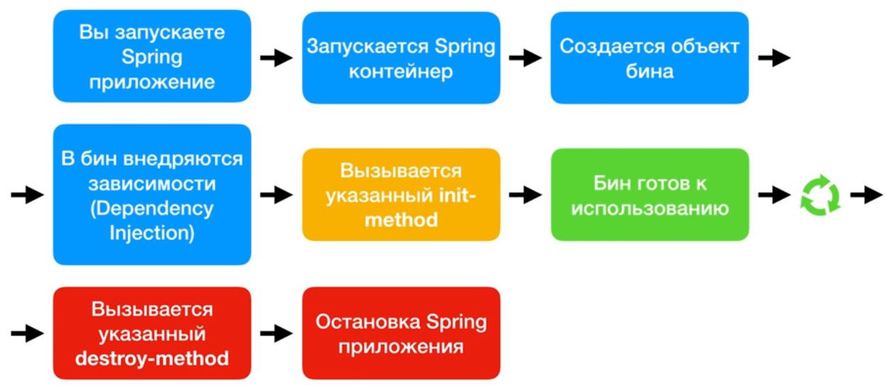

# JAVA CORE

[//]: # (TODO на добавление.уровень SENIOR)
- ClassLoader 
- Lock (Optimistic/Pisimistic) vs Isolation level 
- Patterns 
- CoroutineScope async{} await 
- Monitor/mutex/semaphore
- !!! JMM (large objects in memory) Java 22 Высокопроизводительная Java курс
- GCs
- JMM (happens before, sequental consistency)
- !!!! Профилирование, JMeter
- Java 21 virtual threads
- !!!! Проектирование микросервисов на Java Крис Ричардсон !!!!!!!!!
- Паттерны МКС (Saga (Temporal framework), CircuitBraker, SharedCache) (курс микросервисная архитектура Luxoft, сделан по книге Ричардсона)
- kafka vs rabbit
- reactive system manifesto (реактивное программирование для тех кто привык разрабатывать....)
- reactive vs async
- Курс Асинхронное и реактивное программирование Luxoft
- Уровни зрелости REST API
- Java off-heap memory

[//]: # (TODO на рефакторинг)
- Интерфейс VS Абстрактный классМожно ли перегрузить static метод? 
- А переопределить? 
- Можно ли при перегрузке поменять просто модификатор доступа (сейчас на записи понял, что я перепутал это с переопределением и ответил да)
- Методы класса Objects 
- Как реализован equals, если его не переопределять? 
- Какой контракт между equals и hashcode 
- Рекомендации по тому какие поля следует использовать для вычисления hashcode 
- Примитивы и обёртки, в чем отличия, где хранятся? 
- String, особенности, пул строк
- Исключения
- Стек и куча
- Сборщик мусора, области памяти, какой сборщик используется в Java? 
- Iterator, Collection, ArrayList vs LinkedListПочему Map не наследуется от Collection? 
- Изменится ли размер ArrayList, если удалить из него элемент? 
- Алгоритмическая сложность
- Map, какие параметры есть в конструкторе? 
- Будет ли работать Map, если у всех элементов одинаковый хэшкод? 
- Можем ли мы в каком то случае не найти значение по ключу в Map (вернётся null)? 
- Stream API, зачем map(), недостатки filter(), зачем flatMap()
- Spring Boot
- Бины, способы создания, способы внедрения зависимостей
- @RequeredArgsConstructor, чья аннотация 
- Профили в Spring, зачем нужны? 
- @Component, @Service, @Repository, @Controller
- @RestController VS @Controller
- Можно ли заменить @RestController на @Component? 
- Отличия JPA от Hibernate 
- Типы связей между EntityLazy и Eager 
- Как обойти ошибку LazyInitionalizationException? 
- Спецификации, Criteria API
- Что такое транзакции? 
- Можно ли повесить @Transactional на private метод? 
- Что будет если из method1, помеченного @Transactional вызвать method2. помеченный той же аннотацией? 
- Что будет если из method1 вызвать method2. 
- помеченный @Transactional? 
- Асинхронное/синхронное общение
- Какие паттерны знаешь? Какие использовал? 
- Антипаттерны

### 1. Методы Object.class
`toString()`,
`equals()`,
`hashcode()`,
`wait()`,
`notify()`,
`notifyAll()`,
`getClass()`.
### 2. equals() & hashcode()
- `equals()` гарантирует: если `o1.equals(o2)` вернул `true`, то объекты равны. Если `false`, то элементы точно _не равны_ друг другу.

- `hasCode()` гарантирует что если у 2х объектов разные хэшкоды - эти объекты точно разные, а если хэшкоды равны то либо объекты равны, либо произошла коллизия.

_Прим.:_ При вызове o1.equals(o2) сначала сравниваются их хэшкоды, если хеши не равны, выдаётся `false`, если равны, то вызывается метод `equals()`, который работает долго, но выдаёт точный ответ. (сравнивая объекты по ссылкам)

_Стоит отметить, что для корректной работы, при создании собственного класса, всегда нужно переопределять методы `equals()` и `hasCode()`._
- Рефлексивность. для любого заданного значения x, выражение x.equals(x) должно возвращать true. (Заданного — имеется в виду такого, что x != null)
- Симметричность. для любых заданных значений x и y, x.equals(y) должно возвращать true только в том случае, когда y.equals(x) возвращает true.
- Транзитивность. для любых заданных значений x, y и z, если x.equals(y) возвращает true и y.equals(z) возвращает true, x.equals(z) должно вернуть значение true.
- Согласованность. для любых заданных значений x и y повторный вызов x.equals(y) будет возвращать значение предыдущего вызова этого метода при условии, что поля, используемые для сравнения этих двух объектов, не изменялись между вызовами.
- Сравнение null. для любого заданного значения x вызов x.equals(null) должен возвращать false

### 2.1 в чем особенность Generics?
Они существуют только в compile-time для сохранения обратной совместимости. Во время runtime generic-тип сводится либо к Object, 
если сам параметр (например `Т`) не наследуется ни от какого класса, либо к родительскому классу.

### 2.2 SoftReference (мягкие ссылки)?
Объекты, на которые ссылаются только _**SoftReference**_, собираются сборщиком мусора при нехватке памяти. Мягкие ссылки полезны для реализации кэшей, чувствительных к памяти

### 3. public static void main(String[] args)
psvm - это точка входа Java-программы для виртуальной машины Java (JVM).
- `public`- чтобы JVM имела к нему доступ
- `static`- потому что JVM не умеет создавать экземпляры классов. JVM вызывает <ClassName>.<mainMethod>
- `void` - JVM не ожидает значения от main(). Если другой тип возвращаемого значения, то RunTimeError i.e., NoSuchMethodFoundError.
- `(String[] args)`. JVM вызывает main() передавая аргументы (типа String) командной строкой

### 4. Exceptions (Исключения)
#### Иерархия


_Прим:_
При создании собственного исключения, если мы хотим сделать его проверяемым мы должны наследовать его, например, от I/O Exception

#### Обработка исключений
1. try/catch
2. try/catch+finally. finally{} выполнится всегда, кроме случаев когда:
- самом блоке finally вылетает ошибка
- вызывается метод System.exit()
- операционная система завершит работу JVM
- Если блок finally будет выполняться потоком демона, а все остальные потоки не демоны завершат свое выполнение

3. try with resources. В try создаем некие сущности, которые должны поддерживать интерфейс AutoClosable. По окончанию блока try,
   не зависимо от того было ли исключение или нет, эти сущности закроются. (исп. для чтения потоков или соединения с БД)
#### Можно ли поймать Runtime exception?
Да, можно
#### Когда следует ловить Error?
В общем случае его не стоит ловить, но в частном случае OutOfMemoryErr иногда полезно отлавливать.

### 5 Что такое Интерфейс?
Интерфейс - контракт между классами, который необходимо реализовать в классах.

### 5.1 Абстрактный класс vs Интерфейс
1. Интерфейс описывает только поведение. У него нет состояния. А у абстрактного класса состояние есть: он описывает и то и другое. (в абс. классе можно создавать переменные и сеттеры\геттеры для них, в интерфейсе – нет).
2. Абстрактный класс связывает между собой и объединяет классы, имеющие очень близкую связь (абстр. Класс Птица и Класс наследник Соловей).
 В то же время, один и тот же интерфейс могут реализовать классы, у которых вообще нет ничего общего (инт. Летающий и реализующие его классы Птица и Самолёт).
3. Разрешена множественная реализация интерфейсов (множественное наследование классов запрещено)

#### Дефолтная реализация интерфейсов
1. Сохранение обратной совместимости. Чтобы не было нужды переопределять новый метод интерфейса всех его реализациях,
   пишешь `default` перед названием метода в интерфейсе и всё.
2. Реализация по-дефолту

_Прим.:_ Если класс реализует 2 интерфейса, в каждом из которых есть одинаково названные дефолтные методы, неообходимо будет в явном виде переопредлить
этот метод в классе и указать, чью именно реализацию использовать.

```java
public class Car implements Vehicle, Alarm {

    @Override
    public String turnAlarmOn() {
        return Vehicle.super.turnAlarmOn();
    }
    
    @Override
    public String turnAlarmOff() {
        return Vehicle.super.turnAlarmOff();
    }
}
``` 

#### Functional interface
Интерфейс с одним абстрактным методом @FunctionalInterface. Например: consumer, supplier, function, predicate, operator и их биформы. 
Кол-во `default` методов не ограничено.

_Прим.:_ Их не было до java 8. Нужны же они для обратной совместимости, а также это позволяют избежать 
создания служебных классов, так как все необходимые методы могут быть представлены в самих интерфейсах

### 6. Collections
#### Иерархия

#### Как внутри устроена HashMap?
HashMap состоит из массива односвязных списков - бакетов, размером 16.
При добавлении пары K-V в HashMap высчитывается hashcode ключа `key.hashcode()` и побитово умножается на (n-1), где n - длинна внутреннего массива.
Получается число от 0 до n-1. Данная пара K-V помещается в ячейку соответствующей, числу, полученному в предыдущей операции.
Со всеми следующими парами K-V работа аналогичная.
Если элементов становится слишком много, в HashMap выделяется еще один массив размерностью 16 (_Или каждый бакет становится красно-черным деревом_)
#### Как внутри устроена TreeMap?
Красно-черное дерево

#### Можно ли положить в HashMap объекты, у которых не переопределены методы `equals()` и `hasCode()`?
Можно, но тогда теряется эффективность и скорость работы HashMap

#### Как по другому можно заимплементить Map?
Как простой массив []

#### WeakHashMap?
**_WeakHashMap_** - Отличается от HashMap тем, что использует внутри себя слабые ссылки в роли ключей и значений. Слабые ссылки будут удалены, когда на них больше не будет сильных ссылок. Garbage collector не ждёт когда память будет переполнена, чтобы удалить слабые ссылки, а удаляет их сразу.

_Прим.: WeakHashMap не синхронизирована._ 

### 7. Multithreading (Многопоточность)
#### Способы создания потока:
1. `Clazz extends Thread`. В таком случае клас будет _являться_ потоком.
   Для запуска вызываем метод `start()`
2. `Clazz implements Runnable` переопределить единственный метод `run()`, внутри которого указать, что конкретно будет выполняться данным потоком

_Эти способы не используются на реальных проектах. У разработчика не должно быть возможности самому создавать треды, иначе может начать вылетать ошибки.
Например, Разработчик создал много тредов и, так как под каждый новый тред выделяется фиксированное количество мегабайт (например, 1Мб), то программа начинает уходить в своп при переполнении оперативной памяти._
3. `concurrent.ExecutorService` - фреймворк для работы с потоками. Также в этом фреймворке есть классы для работы с ассинхронностью.

#### Как сделать метод потокобезопасным?
`synchronized` Можно сделать синхронизацию либо по объекту, либо по методу.

#### Какие есть методы для работы с потоками?
`wait(), notify(), notifyAll()`

_Их можно использовать только в synchronized блоках_


#### Deadlock 
Deadlock, или взаимная блокировка, возникает, когда есть несколько потоков и каждый ожидает ресурс, 
принадлежащий другому потоку, так что формируется цикл из ресурсов и ожидающих их потоков. 
Наиболее очевидным видом ресурса является монитор объекта, но любой ресурс, который вызывает блокировку (например,`wait/notify`), также подходит.

Взаимная блокировка происходит, если в одно и то же время:

- Один поток пытается перенести данные с одного аккаунта на другой и уже наложил блокировку на первый аккаунт.
- Другой поток пытается перенести данные со второго аккаунта на первый, и уже наложил блокировку на второй аккаунт.

_Предотвращение deadlock_:
- Порядок блокировок — всегда накладывайте блокировки в одном и том же порядке.
- Блокировка с тайм-аутом — не блокируйте бессрочно при наложении блокировки, 
лучше как можно быстрее снимите все блокировки и попробуйте снова.

_JVM способен обнаруживать взаимные блокировки мониторов и выводить информацию о них в дампах потоков_ 

#### Livelock и потоковое голодание
Livelock возникает, когда потоки тратят все свое время на переговоры о доступе к ресурсу или обнаруживают и избегают тупиковой ситуации так, 
что поток фактически не продвигается вперед. Голодание возникает, когда потоки сохраняют блокировку в течение длительных периодов, 
так что некоторые потоки «голодают» без прогресса.

#### RaceCondition
Состояние гонки возникает, когда один и тот же ресурс используется несколькими потоками одновременно, 
и в зависимости от порядка действий каждого потока может быть несколько возможных результатов. 
Код, приведенный ниже, не является потокобезопасным, и переменная value может быть инициализирована больше, 
чем один раз, так как `check-then-act` (проверка на `null`, а затем инициализация), которая лениво инициализирует поле, не является _атомарной_
```java
class Lazy <T> {
 private volatile T value;
 T get() {
   if (value == null)
     value = initialize();
   return value;
 }
}
```
#### CAS ????
#### Типы данных concurrency (Atomics, ConcurrentHashMap) ????
#### ExecutorService ????

### 8. JMM
Память процесса делится на Stack и Heap и включает 5 областей:
- **_Stack_**
1. Metaspace (previously "Permanent Generation") — используемая JVM память для хранения метаинформации; классы, методы и т.п. 
2. Code Cache — используемая JVM память при включенной JIT-компиляции; в этой области памяти кешируется скомпилированный платформенно-зависимый код.
- **_Heap_**
1. Eden Space — в этой области выделяется память под все создаваемые программой объекты. Жизненный цикл большей части объектов, к которым относятся итераторы, объекты внутри методов и т.п., недолгий. 
2. Survivor Space — здесь хранятся перемещенные из Eden Space объекты после первой сборки мусора. Объекты, пережившие несколько сборок мусора, перемещаются в следующую сборку Tenured Generation. 
3. Tenured Generation хранит долгоживущие объекты. Когда данная область памяти заполняется, выполняется полная сборка мусора (full, major collection).

#### Metaspace
Пространство в Stack, хранящая в себе метаинформацию про классы, методы и тд. Размер Metaspace динамический и не ограничен по умолчанию.
Таким образом он может доходить до размеров нативной памяти. Такой подход помогает избежать OOMErr.

По умолчанию GC проводит сборку мусора при достижении размера MaxMetaspaceSize и при динамическом увеличении размера Metaspace 

#### Команды для управления размерами Heap
- `java –Xmx4G` - максимальны размер 4Gb
- `java –Xms4G` - начальный размер 4Gb

### 9. Garbage Collector
#### Задачи GC
1. Reference counting – учет ссылок. Каждый объект имеет счетчик (количество указывающих на него ссылок).
когда счетчик = 0 объект считается мусором. Из-за невозможности работы с циклическими зависимостями данный подход не используется.  
2. Tracing – трассировка. Идея: до «живого» объекта можно добраться из корневых точек (_GC Root_). 
Всё, что доступно из «живого» объекта, также является «живым». Если представить все объекты и ссылки между ними как дерево, 
то необходимо пройти от корневых узлов GC Roots по всем узлам. При этом узлы, до которых нельзя добраться, являются мусором.


#### GC Root
- Основной Java поток - поток, который выполняет main
- Локальные переменные в основном методе - параметры main метода и локальные переменные внутри main метода
- Статические переменные основного класса - статические переменные основного класса, внутри которого находится main метод

#### Типы GC
- Serial Garbage Collector
- Parallel Garbage Collector
- CMS Garbage Collector
- G1 Garbage Collector (default)
- Shenandoah


### 10. ClassLoader
Загрузчик классов отвечает за поиск библиотек, чтение их содержимого и загрузку классов, содержащихся в библиотеках. 
Эта загрузка обычно выполняется «по требованию», поскольку она не происходит до тех пор, пока программа не вызовет класс. 
Класс с именем может быть загружен только один раз данным загрузчиком классов.

Сам загрузчик классов является частью JRE, которая динамически загружает Java классы в JVM. 
Система исполнения в Java не должна знать о файлах и файловых системах благодаря загрузчику классов. 
Делегирование является важной концепцией, которую выполняет загрузчик.

Всего их три вида:
1. Загрузчик класса bootstrap. Загружает основные библиотеки расположенные в папке <JAVA_HOME>/jre/lib. 
2. Загрузчик класса расширений. Загружает код в каталоги расширений (<JAVA_HOME>/jre/lib/ext, или любой другой каталог, указанный системным свойством java.ext.dirs).
3. Системный загрузчик. Загружает код, найденный в java.class.path, который сопоставляется с переменной среды CLASSPATH

# Структуры данных
### 1. Структуры данных
#### Динамический массив ????
#### Связный список ????
#### Бинарное(двоичное) дерево
Всё, что меньше корня идёт по левой ветке, всё что больше по правой. Корень - первый элемент, помещенный в дерево,
листья - последние элементы, ноды(узлы) - промежуточные. Каждая нода с его потомками отдельное дерево.

Бинарное дерево лучше использовать при неотсортированных данных.
Если в бинарное дерево подавать отсортированные данные, то оно вырождается в двусвязный список.
Сложность всех операций (bad way) такая же, как и у двусвязного списка `O(n)` (медленная)

#### Красно-черное дерево
Самобалансирующееся Бинарное дерево, такое что:
1. Количество черных нод в каждой ветке держится одинаковым.
2. Корень глобального дерева всегда черный (корни поддеревьев могут быть красными)
3. У каждой красной ноды дочки черные
4. Листья (последние элементы в ветке) всегда черные и null.

_Когда одна ветвь становится длиннее других, происходит перебалансировка_

Сложность по всем операциям - `O(log(n))`
#### Б-дерево ??? (каждая нода - массив)

### 2. Алгоритмическая сложность


### 3. Сортировки

#### Сортировка пузырьком

```java
class Scratch {
    public int[] bubbleSort(int[] arr) {
        for(int i = arr.length-1 ; i > 0 ; i--) {
            for(int j = 0 ; j < i ; j++){
                if( arr[j] > arr[j+1] ) {
                    int tmp = arr[j];
                    arr[j] = arr[j+1];
                    arr[j+1] = tmp;
                }
            }
        }
    }
}
```
# Паттерны
### Типы паттернов:
- Порождающие
- Архитектурные (структурные) 
- Поведенческие

### 1. SOLID
- S _single responsibility principle_- принцип единственности ответственности.
У каждого класса должен быть только один мотив для изменений

- O _open/closed principle_ – принцип открытости\закрытости. Класс должен быть открыт для расширения и закрыт для изменения.
Нужно стараться расширять (extend) классы, а не изменять их (Не ломать уже существующий код)

- L _Принцип подстановки Лисков_. Подклассы должны дополнять, а не замещать поведение базового класса.
Если класс "B" является подклассом "A", то объекты классы "А" могут быть заменены объектами класса "B", без нарушения работоспособности системы

- I _interface segregation principle_. Принцип разделения интерфейса. Клиенты не должны зависеть от методов, которые они не используют.
(нужно стараться делать узкоспециализированные интерфейсы, чтобы не приходилось реализовывать избыточное поведение)

- D _Принцип инверсии зависимости_. Классы верхних уровней не должны зависеть от классов нижних уровней. Оба должны зависеть от абстракций.
Абстракции не должны зависеть от деталей. Детали должны зависеть от абстракций. (Зависимости должны быть не напрямую (сильными),
а через абстракции(слабыми)). _Прим.:_ Зависимости через интерфейсы, а не через наследование

### 2. GOF
- Декоратор - композиция. Один класс внедрён в другой класс как поле.
- Фасад - инкапсуляция. сложная реализация спрятана за удобными методами.
- Фабрика - очень похож на _Builder_. Специальный класс , которому делегируем создание экземпляра другого класса. Те же функции берет на себя и фабричный метод.
- Singleton. Разрешает создавать не более одного экземпляра класса.
- Strategy. В зависимости от состояния выполнить то или иное действие (switch/case, if/else)

# Базы данных
### 1. ACID
_Атомарность_ (atomicity). Атомарность гарантирует, что каждая транзакция будет выполнена полностью или не будет выполнена совсем.
Не допускаются промежуточные состояния.

_Согласованность_ (consistency). В результате работы транзакции данные будут допустимыми.
Это вопрос не технологии, а бизнес-логики: например, если количество денег на счете не может быть отрицательным, логика транзакции должна проверять, не выйдет ли в результате отрицательных значений.

_Изолированность_ (isolation). Гарантия того, что параллельные транзакции не будут оказывать влияния на результат других транзакций.

_Долговечность_ (durability). Изменения, получившиеся в результате транзакции, должны оставаться сохраненными вне зависимости от каких-либо сбоев.
Иначе говоря, если пользователь получил сигнал о завершении транзакции, он может быть уверен, что данные сохранены.

### 2. Изолированность БД (TODO refactor)
- _Версионирование_ (snapshot) означает, что транзакции будут работать со своей копией данных, не влияя друг на друга,
но впоследствии несколько изменённых копий надо будет как-то слить в одну. Строгость версионирования регулирует моменты (когда) и размеры (сколько данных копировать) этих копий.
- _Блокирование_ (lock) означает, что одна транзакция будет ждать другую, чтобы избежать побочных эффектов,
в зависимости от строгости уровней изоляции этих транзакций. Различные виды блокировок обеспечивают более гранулярное блокирование,
например, только по строкам, или только на небольшой кусочек транзакции, а не на всю.

### 3. Уровни изолированность БД (TODO refactor)
READ UNCOMMITED — решается с помощью аннотации Version в JPA(об этом как раз и статья)
READ COMMITED — позволяет читать только закоммиченные изменения
REPEATABLE READ — транзакция «не видит» изменения данных, которые были ею ранее прочитаны, а другие транзакции не могут изменять тех данных, что попали в нашу транзакцию.
SERIALIZABLE — последовательное выполнение транзакций

Подробнее:
- _Read Uncommitted_. Ничего не происходит в режиме read uncomitted. То есть ничего не блокируется и не создаются снэпшоты, транзакция просто читает всё что хочет.
По смыслу, этот режим можно отнести к (очень) оптимистичному — блокировки редки и коротки.
- _Read committed_ (то есть отсутсвие dirty reads) обеспечивается блокировкой на запись данных (строк), которые мы пытаемся прочитать.
Эта блокировка гарантирует, что мы подождём завершения транзакций, которые уже меняют наши данные, или заставим их подождать, пока мы будем читать.
В итоге, мы точно прочитаем только данные, которые были закоммичены, избежав тем самым грязное чтение. Этот режим — типичный пример пессимистичной блокировки, так как мы блокируем данные на запись, даже если в них никто реально не пишет.
- _Read commited_ snapshot (второй способ избежать dirty reads) обеспечивается версионированием блока данных, который мы читаем.
Любое его параллельное изменение на затронет нашу версию, и нам достанутся данные на момент начала чтения. Таким образом грязное чтение отсутствует, и ещё отсутствуют какие-либо блокировки*. Этот режим скорее оптимистичный, так как заранее ничего не блокируется, и тут как раз может быть конфликт обновления.
- _Repeatable read_ (то есть отсутствие всего, кроме фантомных чтений) обеспечивается почти как read commited, за тем исключением,
что блокировка на запись работает до конца транзакции, а не отдельной операции. Единожды “коснувшись” блока данных, транзакция блокирует его изменение до конца работы, что обеспечивает отсутствиуе dirty reads и non-repeatable reads.
Это более пессимистичный вид блокировки, чем read committed, так как блокировка держится ещё дольше.
- _Serializable_ (нет никаких побочных эффектов) обеспечивается блокировкой и на запись, и на чтение любого блока данных, с которым мы работаем.
Блокируется даже вставка данных, которые могут попасть в блок, который мы прочитали. Таким образом, за счёт низкой конкурентности, обеспечивается отсутствие даже фантомных чтений. Это более пессимистичный вид блокировки, чем repeatable read, так как блокировка держится ещё дольше.
- _Snapshot_ обеспечивается созданием нашей отдельной версии данных, с которыми мы работаем, без блокировок*.
Другие транзакции не будут иметь доступ к нашей версии, чем и обеспечивается отсутствие всего вплоть до фантомных чтений. Это оптимистичный вид блокировки, но менее оптимистичный, чем read committed snapshot, так как больше шансов получить конфликт обновления.

### 4. Нормализация БД ???
Нормализация БД – устранение избыточности
### 5. Партицирование
Деление таблицы на части по некоторым данным (по строкам). Например, по дате создания записи. Одну партицию можно удалить, и это не нанесет вреда другим партициям.
### 6. Шардирование
Деление таблицы по столбцам (Часть столбцов в одной таблице, часть в другой)
### 7. Что такое view ????
Заранее сохраненный SELECT ???
### 8. Что такое триггер
Команда, которая вешается на какое-то действие и выполняется при выполнении прослушиваемого события. (например на INSERT, DELETE и тд)

### 9. Индексы БД. Когда применяем, когда избегаем ???
### 10. Масштабирование БД
- _**Партиционирование**_ — это разбиение таблиц, содержащих большое количество записей, на логические части по неким выбранным администратором критериям. 
Партиционирование таблиц делит весь объем операций по обработке данных на несколько независимых и параллельно выполняющихся потоков, что существенно ускоряет работу СУБД. 
Для правильного конфигурирования параметров партиционирования необходимо, чтобы в каждом потоке было примерно одинаковое количество записей.

_Например_, на новостных сайтах имеет смысл партиционировать записи по дате публикации, так как свежие новости на несколько порядков более востребованы 
и чаще требуется работа именно с ними, а не со всех архивом за годы существования новостного ресурса.
- _**Репликация**_ — это синхронное или асинхронное копирование данных между несколькими серверами. Ведущие сервера называют мастерами (master), 
а ведомые сервера — слэйвами (slave). Мастера используются для изменения данных, а слэйвы — для считывания. В классической схеме репликации обычно 
один мастер и несколько слэйвов, так как в большей части веб-проектов операций чтения на несколько порядков больше, чем операций записи. 
Однако в более сложной схеме репликации может быть и несколько мастеров.

_Например_, создание нескольких дополнительных slave-серверов позволяет снять с основного сервера нагрузку и повысить общую производительность системы, а также можно организовать слэйвы под конкретные ресурсоёмкие задачи и таким образом, например, упростить составление серьёзных аналитических отчётов — используемый для этих целей slave может быть нагружен на 100%, но на работу других пользователей приложения это не повлияет.
- _**Шардинг**_ — это прием, который позволяет распределять данные между разными физическими серверами. Процесс шардинга предполагает разнесения данных 
между отдельными шардами на основе некого ключа шардинга. Связанные одинаковым значением ключа шардинга сущности группируются в набор данных по заданному ключу, 
а этот набор хранится в пределах одного физического шарда. Это существенно облегчает обработку данных.

_Например_, в системах типа социальных сетей ключом для шардинга может быть ID пользователя, таким образом все данные пользователя будут храниться и обрабатываться на одном сервере, а не собираться по частям с нескольких
### 11. Пагинация. Какие есть виды? (обычная и seek) В чём разница? Какой вид применяем в той или иной ситуации? ???
Дано: 10,000 записей и из них нужно сделать постраничный вывод (размер страницы = 10) по какому-нибудь параметру, например, по дате.
#### обычная (offset) пагинация:
В _offset_ пагинации происходит выборка по всем записям таблицы. При выводе каждой следующей страницы происходит сортировка записей из новой и всех старых страниц. То есть при выводе первой страницы, сортируется 10 эл-тов, при второй 20 эл-тов и тд. Из-за этого каждый вывод следующей страницы будет происходить дольше чем предыдущей.
- Худший вариант - _нет индекса сортировки_:
Сложность поиска первых страницы растёт линейно в зависимости от количества эл-тов (алгоритм _**top-N heapsort**_). Сложность поиска последних страниц растёт быстрее, чем в предыдущем кейсе из-за использования более затратного алгоритма по памяти (_**external-merge**_), создающего временную таблицу. Из-за большого потребления памяти в этом алгоритме часто используется жесткий диск, поэтому и скорость сортировки тоже уменьшается 
- _добавляем индекс сортировки_:
Сложность поиска первых страницы не растёт вовсе и не зависит от количества элементов. Сложность поиска последних страниц тем не менее чуть лучше, чем в "худшем варианте", но Postgres всё-равно вынужден использовать _**external-merge**_, соответственно использовать больше памяти через ssd, что уменьшает скорость  
#### seek пагинации:
- _Без индекса сортировки_. В данном методе по-прежнему идёт выборка из всех записей таблицы, но сортировка происходит только по N записям, где N - размер страницы. 
Данный метод заключается в том, чтобы не работать каждый раз со всеми элементами, а при каждом выводе следующей страницы, отсекать предыдущие варианты (как будто бы их и не было). То есть при выводе первой страницы алгоритм сортировки (_**top-N heapsort**_) работает только с 10 данными, при втором выводе тоже с 10 и тд. При этом сам алгоритм считает что с выводом каждой новой страницы общий размер таблицы уменьшается на размер страницы: Первая страницы - 10,000 эл-тов вторая страница 9,990 эл-тов и т.д.
- _С индексом сортировки_. При такой пагинации алгоритм быстро находит 10 строк в индексе и сразу их возвращает. Сложность поиска - 0(1). Скорость будет зависеть только от глубины индекса, что может ухудшить ситуацию на больших данных.

Ограничение seek-пагинации: 
- нельзя перейти на конкретную страницу (возможны только последовательные переходы по страницам).
- Не все ORM поддерживают составные значения используемые в seek-пагинации, но можно их эмулировать.
- затрудняется подсчет количества страниц.

_Таки образом seek пагинация очень хорошо подходит для "бесконечного скроллинга"_

# SPRING
### 1. В чем идея Spring?
1. Внедрение и управление зависимостями (Dependency injection).
2. Инверсия управления (IoC)
3. Предоставление удобных интерфейсов для взаимодействия с Вебом.

### 1.1. Способы внедрить зависимость
1. Через конструктор. Преимущество: данный способ будет внедрять зависимости и БЕЗ Spring (если вдруг захотел поменять DI фреймворк). 
2. через поле. Недостаток: Когда DI на поле, то Spring через рефлексию (у класса найдёт это поле и по нему найдет зависимость которую надо внедрить). 
Следовательно - более слабый перформанс.
3. через сеттер (устарело)

### 2. Что такое Bean?
Т.н. "Спринговский объект", то есть это обычный экземпляр java-класса, который внесли в контекст спринга (SpringApplicationContext) - контейнер бинов.

#### Способы создать бин
1. Через XML
```xml
<beans>
   <!-- A simple bean definition -->
   <bean id = "fromBeanMessage" class = "com.example.Message">
       <property name="message" value="This is message from simple bean"/>
      <!-- collaborators and configuration for this bean go here -->
   </bean>
   <!-- A bean definition with lazy init set on -->
   <bean id = "lazy" class = "com.example.Lazy" lazy-init = "true">
      <!-- collaborators and configuration for this bean go here -->
   </bean>
   <!-- A bean definition with initialization method -->
   <bean id = "init" class = "com.example.Message" init-method = "getMessage">
      <!-- collaborators and configuration for this bean go here -->
   </bean>
   <!-- A bean definition with destruction method -->
   <bean id = "destroyBean" class = "com.example.Message" destroy-method = "getMessage">
      <!-- collaborators and configuration for this bean go here -->
   </bean>
</beans>
```
2. Через java-код
3. Через аннотации
`@Component` - вешается над классом, говоря спрингу, что от данного класса нужно создать бин
`@Bean` - вешается над методом, возвращаемое значение которого будет являться бином.
Используется в классах помеченных `@Configuration`

#### Жизненный цикл бина


#### Init/destroy - методы
- init-метод вызывается сразу после внедрения в бин всех необходимых зависимостей.
- destroy-метод вызывается после остановки контекста

_Прим.:_ post-destroy у прототипов не вызывается

#### BeanDefiniton ???
#### BeanPostProcessor ???

#### Bean scope (область видимости бина)
- _Singleton_ (по умолчанию). Бин с данным именем создаётся 1 раз в Spring Application Context и каждый раз при вызове getBean() вызывается тот самый бин. Используется, когда у бина нет изменяемых состояний (stateless)
- _Prototype_. При вызове getBean() каждый раз будет создаваться новый бин в Spring Application Context. Используется, когда у бина есть изменяемые состояния (statefull)
- _Request_. Создаётся один экземпляр бина на каждый HTTP запрос. Касается исключительно ApplicationContext.
- _Session_. Создаётся один экземпляр бина на каждую HTTP сессию. Касается исключительно ApplicationContext.
- _Global-session_. Создаётся один экземпляр бина на каждую глобальную HTTP сессию. Используется только с портлетами. Касается исключительно ApplicationContext.

### 2. Виды контейнеров бинов.
В Spring имеется 2 различных вида контейнеров:
1. Spring BeanFactory Container. Реализации: XmlBeanFactory
2. Spring ApplicationContext Container. Реализации: FileSystemXmlApplicationContext, ClassPathXmlApplicationContext, WebXmlApplicationContext

### 3. Аннотации
- `@ComponentScan` вместе с аннотацией `@Configuration`, чтобы указать пакеты, которые мы хотим сканировать.
`@ComponentScan` без аргументов указывает Spring сканировать текущий пакет и все его подпакеты.
- `@Autowired`. В `SpringApplicationContext` хранятся все бины (Классы, на которых висит `@Component` или их бин создан в явном виде в xml или через `@Bean`).
`@Autowired` внедряет ссылку на существующий бин в поле, над которым висит `@Autowired`.
Если scope бина “prototype”, то при `@Autowired` полю присваивается ссылка на новый бин.
_Прим.: Внедрять зависимости через `@Autowired` следует через конструктор, тк через конструктор зависимости могут быть final,
а значит потокобезопасными. Также, можно не писать @InjectMocks при написании юнит-тестов._
- `@Service`, `@Repository` - аналоги `@Component` (синтаксический сахар)
- `@Controller` (`@RestController`) говорит спрингу исследовать данный класс на наличие аннотации `@RequestMapping`. Другие стереотипные аннотации такого не делают
- `@RestController` = `@Component` + `@ResponseBody`
- `@Qualifier`. Используется для указания конкретного бина для внедрения в другой бин при условии, что есть несколько бинов одного типа
- `@Primary`. Определяет предпочтение, когда присутствует несколько bean-компонентов одного типа.
Компонент, связанный с аннотацией @Primary, будет использоваться, если не указано иное.
- `@Transactional`. Делает методы над которыми висит транзакционными (обладающими свойствами транзакции)
[https://habr.com/ru/post/532000/]()

### 4. @Transactional
#### Будет ли при вызове method2 из метода method1 создана новая транзакция?
```java
public class MyServiceImpl {

    @Transactional
    public void method1() {
        //do something
        method2();
    }

    @Transactional(propagation=Propagation.REQUIRES_NEW)
    public void method2() {
        //do something
    }
}
```
_Ответ:_ Для поддержки транзакций через аннотации используется Spring AOP, в момент вызова method1() на самом деле вызывается метод прокси объекта.
Создается новая транзакция и далее происходит вызов method1() класса MyServiceImpl.
А когда из method1() вызовем method2(), обращения к прокси нет, вызывается уже сразу метод нашего класса и, соответственно, никаких новых транзакций создаваться не будет
_Решение:_:
1. Рефакторинг. Создание новой абстракции (например `Facade`), которая будет атомарно вызывать методы сервиса, помеченные `@Transactional`.
Таким образом избегается перекрестный вызов транзакционных методов друг-другом
2. Self-inject класса и вызов метода через него. _Прим.:_ Работает только для бинов со scope `singleton`,
для `prototype` при старте приложения упадёт ошибка циклического внедрения бина самого в себя
```java
@Service
@Transactional
class Clazz {
    
@Autowired
Clazz clazz;

  void method1(){//транзакция создается
    clazz.method2();//транзакция создается
  }
  void method2(){
  }
}
```
3. Использовать TransactionTemplate

_Пример:_
```
transactionTemplate.execute(new TransactionCallback()
   {
    // код в этом методе выполняется в транзакционном контексте         
    public Object doInTransaction(TransactionStatus status)
    {               
    updateOperation1();    
       return resultOfUpdateOperation2();   
    }
  });  
```
### 5. Spring AOP
[https://habr.com/ru/post/347752/]()

#### Создание прокси
Проксирование происходит на этапе создания бинов. Реализуется паттерн Proxy. Для того чтобы ????????

#### (CGLib VS JDK Dynamic proxy)
- JDK Dynamic proxy может проксировать только по интерфейсу (целевой класс должен имплементить интерфейс, который потом заимплементит проксирующий класс).
- CGLib может создать прокси по подклассу (наследованием). CGLib по факту создаёт наследника нашего класса, поэтому при использовании CGLib не получится делать `final`-классы

_Прим1:_ поскольку javassist и CGLIB используют прокси путем создания подклассов, по этой причине вы не можете объявлять `final`
методы или делать класс `final` при использовании фреймворков, которые полагаются на это. Это помешает этим библиотекам создавать подклассы вашего класса и переопределять ваши методы

_Прим2:_ CGLib быстрее на 15%, чем DynamicProxy.

_Прим3:_ По умолчанию, если класс реализует хотя бы один (_не пустой, как Serializable_) интерфейс, то будет использоваться JDK dynamic proxy для создания прокси.
Изменить поведение по умолчанию можно настройкой `proxy-target-class=true`. _Это в старых версиях SpringBoot.
С версии SpringBoot 2.0 - наоборот, по умолчанию используется CGLib (проксирование через наследование)_

### 6. SpringData
#### Интерфейсы SpringData
- CrudRepository
- PagingAndSortingRepository
- JpaRepository

### 7. Замена switch/case с использованием спринга (полиморфизма)


# Hibernate
### Ошибка N+1
[https://yannbriancon.com/blog/eliminate-hibernate-n-plus-one-queries/](https://yannbriancon.com/blog/eliminate-hibernate-n-plus-one-queries/)

Проблема N+1 это при `fetch.Type.EAGER` подгружается вся структура сущности + ее наследники (которых N штук).
Каждая из дочерних сущностей подгружается отдельным запросом. Итого идут запросы на получение N (всех связанных элементов)+ 1(основной элемент).
#### Решение N+1
Подход Spring Data:

`@Fetch.Type.Lazy`

_User one2many Role_
```java
public interface UserRepository extends CrudRepository<User, Long> {
// Проблема
    List<User> findAllBy(); // происходит проблема N+1

// Решение 1
    @Query("SELECT p FROM User p LEFT JOIN FETCH p.roles")  
    List<User> findWithoutNPlusOne(); // используя LEFT JOIN, мы решаем проблему N + 1

// Решение 2
    @EntityGraph(attributePaths = {"roles"})                
    List<User> findAll(); //используя attributePaths, Spring Data JPA позволяет избежать проблемы N + 1

}
```
### Кэши Hibernate ???

### Hashcode для Hibernate сущностей
Как определить hashcode для сущностей Hibernate? Что делать, если объект пока не сохранён в БД и у него нет id?
В этом вопросе часто упоминается статья Thorben Janssen Ultimate Guide to Implementing equals() and hashCode() with Hibernate
(https://thorben-janssen.com/ultimate-guide-to-implementing-equals-and-hashcode-with-hibernate/)В самом конце там вывод: если для сущности id генерируется в БД, то hashcode должен возвращать константу.
Почему это не лучший вариант?
Контракт соблюдается, всё работает корректно. Но задача хэша — быстрая проверка схожести объектов. Мы теряем преимущество быстрого поиска, и хэшсет будет работать как список. Так будет и для новых объектов, и для уже сохранённых (у которых id есть).
Другие авторы рекомендуют считать хэш Hibernate сущностей на основе всех полей кроме id. В чём недостатки такого решения:
- ❌ Если поля изменяемые, есть шанс потерять объект внутри HashSet
- ❌ Цель хэша — быстрая проверка. Если считать хэш всех полей, с тем же успехом можно использовать списки и сравнение через equals

Что же делать?
- Использовать для хэша любое неизменяемое поле
  Даже если поле не уникальное, распределение хэшей будет лучше, чем у константы
- Не использовать хэш-структуры для новых объектов
  Новые объекты собирать в список:
  List users = …
  users.forEach(u -> session.save(u));
  Тогда в хэшкоде можно спокойно использовать id и для уже сохранённых объектов хэшсет будет работать как надо:
  Set users = …
  if (!users.contains(…)) {…}

Итого:
- Полноценный hashcode нужен только, когда объект используется в hash-based структурах. Если новые объекты не складываются в HashSet или HashMap, то проблемы вообще нет
- Если вы хотите возвращать в хэшкод константу, рассмотрите вариант хранения сущностей в ArrayList или TreeSet
  Ответ на вопрос в заголовке: it depends. Если новые объекты User собираются в коллекцию, я бы складывал в список, а hashcode реализовала как return id; Но ситуации бывают разные, решение не универсально.
  И более глобальные выводы:
  Хороших материалов по разработке мало. Но даже в хороших легко свернуть не туда. Статья Thorben Janssen в целом ок, но итог немного сбивает с толку. Сравните:
- "Если для сущности id генерируется в БД, hashcode должен возвращать константу"
- "Если новые Hibernate сущности складываются в hash структуры, и у них нет final полей, то для соблюдения контракта можно использовать в hashcode константу"
  Второй вариант корректнее, но первый проще и лучше запоминается.

# Сети
### 1. Как работает HTTP ???
### 2. Отличие HTTP от HTTPS ???
### 3. Коды ответов на HTTP-запрос
200 ок, 300 перенаправление, 400 ошибки клиента, 500 ошибки сервера

### 4. Виды HTTP-запросов
- _GET_. Цель – получение данных с сервера. URL может содержать параметры.
Тело запроса пустое. Может передавать только пары ключ-значение.
- _POST_. Цель – изменить данные на сервере. Все параметры хранятся в теле запроса.
Тип данных (ключ-значение, JSON, XML, и т.д.). URL не содержит данные.
- _PUT_. Цель – добавить или обновить данные на сервере. Если в данной теме ничего нет, то Put создаст (Insert) новую запись,
но если в ней уже что-то есть, то Put обновит данные. Put-запрос идемпотентен, то есть при последующих операциях количество записей в БД не изменяется
- _DELETE_. Цель – удалить данные

### 5. Идемпотентные методы
Метод HTTP является идемпотентным, если повторный идентичный запрос, сделанный один или несколько раз подряд, имеет один и тот же эффект, _не изменяющий состояние сервера_.
Другими словами, идемпотентный метод _не должен иметь никаких побочных эффектов_ (side-effects), кроме сбора статистики или подобных операций.
Корректно реализованные методы GET, HEAD, PUT и DELETE идемпотентны, но не метод POST.
Также все безопасные методы (GET, HEAD или OPTIONS) являются идемпотентными

### 3. Cookies ???
### 4. REST
REST - representative state transfer
1) _client-server_. Отделение потребности интерфейса клиента от потребностей сервера, хранящего данные, повышает переносимость кода клиентского интерфейса на другие платформы, а упрощение серверной части улучшает масштабируемость.
2) _stateless_. в период между запросами клиента никакая информация о состоянии клиента на сервере не хранится
3) _cacheability_. Возможеость сервера кешировать ответы (при этом клиент должен знать, какой ответ был отправлен сервером из кеша)
4) _layerd-system_. Клиент не способен определить, взаимодействует он напрямую с сервером или же с промежуточным узлом, в связи с иерархической структурой сетей. Применение промежуточных серверов способно повысить масштабируемость за счёт балансировки нагрузки и распределённого кэширования
5) _Код по требованию_. REST может позволить расширить функциональность клиента за счёт загрузки кода с сервера
6) _Единообразие интерфейсов_. Унифицированные интерфейсы позволяют каждому из сервисов развиваться независимо

### 5. Как сделать асинхронное взаимодействие через REST?
- WebClient
- Сначала делается запрос и в ответе приходит id запроса. 
Далее с периодичностью в некоторое время делается запрос с этим айдишником к серверу 
и когда данные по айдишнику появляются, при следующем запросе они отдаются в ответ. (аналог с circuit breaker)

### 6. HATEOS

### Jetty vs Tomcat
Конфигурируются в xml.
Jetty использует NIO

# Микросервисная архитектура
### Почитать
[MSA](https://neowiki.neoflex.ru/pages/viewpage.action?pageId=102988605)

### 1. CAP
В любой реализации распределённых вычислений возможно обеспечить не более двух из трёх следующих свойств:
- согласованность данных (англ. consistency) — во всех вычислительных узлах в один момент времени данные не противоречат друг другу;
- доступность (англ. availability) — любой запрос к распределённой системе завершается корректным откликом, однако без гарантии, что ответы всех узлов системы совпадают;
- устойчивость к разделению (англ. partition tolerance) — расщепление распределённой системы на несколько изолированных секций не приводит к некорректности отклика от каждой из секций.
### 2. Виды масштабирования
- Вертикальное масштабирование – Пример: наращивание мощности компьютера
- Горизонтальное масштабирование – Пример: увеличение количества компьютеров

_Прим.:_ Предпочтительнее - горизонтальное, из-за невозможности бесконечного вертикального наращивания,
а также из-за отказоустойчивости (если один из нескольких компьютеров выйдет из строя, это скажется только на сервисах, запущенных на данном компьютере).
## Паттерны МСА ???
ПРОЧИТАТЬ
- [Паттерны МСА](https://neowiki.neoflex.ru/pages/viewpage.action?pageId=80381763)
- [лекция про переход к МСА TransactionalOutBox](https://neostudy.neoflex.ru/course/view.php?id=702)

### Transactional outbox 
Статья [Transactional Outbox](https://neowiki.neoflex.ru/pages/viewpage.action?pageId=102988605)

Ситуация:
```java
@Service
@RequiredArgsConstructor
public class OrderCreationService {
 
    private final OrderRepository orderRepository;
    private final EventPublisher eventPublisher;
 
    public void create(Order order) {
        orderRepository.save(order);
        eventPublisher.publish(new OrderCreatedEvent(order));
    }
}
```
Как гарантировать согласованность между обеими операциями записи?
- Навесить аннотацию `@Transactional` над методом, чтобы если что вдруг пойдет не так, то транзакция откатится.  
**НО** транзакции поддерживают не все БД. Кроме того, сохранение в БД через Hibernate может быть отложенным, так что, как результат, получим отправку 
данных в брокер сообщений и возможный отказ сохранения в БД по причине, например, констреинтов. 
Также в распределенных системах довольно сложно определить точный момент сетевого сбоя, произошел ли он до того, как целевая система получила и обработала 
запрос, или после, поэтому мы не знаем, следует ли продолжить транзакцию или прервать ее.

- Использовать распределенную транзакцию, которая охватывает БД и брокер сообщений. 
**НО** такие решения не хороши, потому что подразумевают 
блокировки и плохо масштабируются. Ко всему та же кафка (как и многие современные брокеры) не поддерживает распределенные транзакции. 

_В связи с этим приложения должны задействовать другой механизм для надежной публикации сообщений. Рассмотрим его._

- **Использование таблицы базы данных в качестве очереди сообщений - _Transactional outbox pattern_**
У сервиса, отправляющего сообщения, есть таблица OUTBOX. В рамках транзакции, которая создает, обновляет и удаляет 
бизнес-объекты, сервис шлет сообщения, вставляя их в эту таблицу. Поскольку это локальная **ACID** - транзакция, _атомарность гарантируется_.

<details><summary>Таблица OUTBOX может выглядеть так</summary>
<code>
create table OUTBOX (
 id varchar(255) primary key,
 aggregate_type varchar(255) not null,
 aggregate_id varchar(255) not null,
 type varchar(255) not null,
 payload text not null
);
</code>

- aggregate_type: тип aggregate root, к которому относится полученное событие. В нашем случае - это сущность Order.
- type: тип события. Например, “OrderCreated.”
- payload: JSON-представление содержимого самого события. Может содержать order ID, customer ID, сумму, etc.
</details>

Сохраняя запись в таблицу OUTBOX, мы гарантируем доставку события хотя бы 1 раз (at-least-once). Брокер, в который отправляем сообщение, может быть 
недоступен продолжительное время. Но у нас есть запись сообщения в таблице, которое мы отправим при восстановлении брокера.

Далее, применяя паттерн _**Polling publisher**_ с помощью, например, шедулера раз в какое-то время мы опрашиваем таблицу OUTBOX и если в ней появились новые записи, отправляем данные о событии в брокер.

_Пример:_
```java
@RequiredArgsConstructor
class StoreAndForwardEventPublisher implements EventPublisher {
 
    private final EventStore eventStore;
    private final EventPublisher kafkaEventPublisher;
 
    @Override
    public void publish(Event event) {
        eventStore.save(event);
    }
 
    @Scheduled(fixedRate = 3000) // каждые 3 секунды
    public void publishAllPeriodically() {
        List<Event> events = eventStore.toPublish();
        events.forEach(kafkaEventPublisher::publish); //отправка сообщений в kafka
        eventStore.markAsPublished(events); // помечаем в OUTBOX сообщения как отправленные. Альтернативный вариант - удаление записи из таблицы
    }
}
```

_**Прим 1:**_ шедулер, который читает данные из OUTBOX и отправляет брокеру, должен в момент времени работать только на одном инстансе приложения, дабы избежать конкурентного чтения общей таблицы Outbox.

_**Прим 2:**_ настройка для шедулера в 3 секунды условна и определяется реальным потоком сообщений, приходящих в систему.

_**Прим 3:**_ Отправка событий-дубликатов. Очевидно, что после отправки события брокеру и перед попыткой удаления записи-события в таблице Outbox может произойти 
сбой (на последней строке). При возобновлении процесса данная запись будет повторно отправлена брокеру, т.к. она не удалена (или не помечена, как отправленная):

_**Прим 4:**_ Добиться реализации отправки события точно 1 раз (exactly once) - задача сложная и обычно избыточная. 
Проще решить проблему доставки at-least-once. Паттерн OUTBOX как раз и гарантирует доставку хотя бы 1 раз. 
Но тогда на стороне получателя таких сообщений необходимо решать проблему двойных записей - требуется сделать идемпотентного потребителя.
Что означает: в данной концепции полученное потребителем сообщение будет иметь одинаковый эффект вне зависимости от того, сколько раз оно получено. 
Потребитель при получении события из брокера должен проверять, не обработал ли он его ранее. Если ответ "да" - сообщение игнорируется. 
Аналогично таблице Outbox (на стороне отправителя) необходимо реализовать таблицу Inbox на стороне потребителя. Она будет содержать уже обработанные UUID-ы пришедших ранее событий.


### Chain of responsibility
Дан код:
```java
public class MainHandler{
    public void handle(DataObject dataObject){
        handle1(dataObject);
        handle2(dataObject);
        handle3(dataObject);
    }
}
```
_**Нарушается open\closed principle**_ 

Решение: Реализовать chain of responsibility применив Spring
1. Сделать каждый `Handler` отдельным бином, реализующим интерфейс `Handler` 
2. Внедрить список `List<Handler>` как зависимость (Spring подтянет как список из всех бинов, реализующих `Handler`)
3. Вызвать метод `handle()` у каждого Handler'а

_**Прим: Если важен порядок - используй аннотацию @Order_** 

```java
@Service
public class MainHandler{
    @Autowired
    private List<Handler> handlers;
    
    public void handle(DataObject dataObject){
        handlers.forEach(handler -> handler.handle(dataObject));
    }
}
```
### Strategy (В зависимости от параметра реализовать ту или иную бизнес-логику)
1. `if/else` плохо читаем и съезжает право на экране
2. `switch/case` неудобен при более 5 ветвлений + можно допустить ошибку забыв про break
3. Идеальное решение - использовать полиморфизм + Spring

```java
public class MessageSender{
    public void handle(DataObject dataObject){
        handle1(dataObject);
        handle2(dataObject);
        handle3(dataObject);
    }
}
```

# Брокеры 

### Отличие подхода "очереди" (RabbitMQ) и "топики" (Kafka):
- К очереди подключается только один консьюмер, считывает последовательно и сообщения после этого пропадают.
- К топику можно подключить сколько угодно консьюмеров, каждый из консьюмеров будет читать тот offset, на котором он остановился.
  Сообщения после считывания не пропадают (есть срок годности).

## Kafka
[ссылка на конфу по кафке](youtube.com/watch?v=PgkRhlUwYyE&ab_channel=JPoint%2CJokerиJUGru)
### Краткая инфа:
- Модель _publisher-subscriber_
- У каждого подписчика есть свой _**offset**_ - номер первого непрочитанного сообщения
- Подписчики, которые читают сообща, находятся в одной consumer-группе, _у них общие offset'ы_
- Сообщения распределяются по партициям _**ключу партицирования**_. От каждого сообщения считается hash-функция и высчитывается остаток от деления на число партиций
- Для отказоустойчивости используются _**брокеры**_, которые содержат в себе копии сообщений. Обычно брокера 3
- Удаляются сообщения согласно 2м стратегиям: _**по времени**_ (default- неделя) или _**по размеру очереди**_
- Чтение обычно происходит пачками. Настройка `max.pool.records`. После изучения новой пачки фиксируется новый offset.
- Время чтения одной пачки сообщений настраивается через `max.pool.intervals.ms`. Если _consumer_ не успевает прочитать сообщения за отведенное время, его отстраняют, заменяя следующим, группу перебалансируют.
### Kafka, основные компоненты
1. **Брокеры** (обычно 3 шт)
2. Брокеры хранят в себе **топики**
3. топики Хранят в себе **партиции**. Каждая партиция представляет собой транзакционный лог. Данные в топиках не меняются. Пишем с конца, читаем сначала (FIFO)
4. Читаем сообщения по смещению - **offset**
5. Сообщения содержат в себе **offset**, **key**, **value**, **timestamp**, **headers**
6. **Key** используется как локатор партиции. Считаем хэш от ключа, потом делим на количество партиций. Остаток от деления и есть номер конкретной партиции.
7. Каждая партиция реплицируется согласно **механизму репликации**. Количество реплик настраиваемо. Всегда есть одна **Leader** партиция и 0-N **Follower** партиций.
8. Клиентами брокеров являются **Producers** и **Consumers**.

#### Producer
1. отправляет сообщение брокеру. 
2. Между _Продьюсером_ и _Брокером_ есть политика acknowledge: "отправил и забыл" или брокер должен ответить продюсеру об успехе обработке сообщения (запись в Leader)
3. брокер записывает сообщение в **Leader** партицию. Все клиенты работают с Leader
4. Сообщение реплицируется на следующий брокер(если он есть).
5. Если один из брокеров падает, то остальные партиции повышаются до Leader

_Прим.: Если acknowledge настроен на ожидание ответа об успехе от Брокера, то может возникнуть ситуация когда по какой-то причине брокер не отправляет ответ об успехе обработки сообщения. Продюсер считает, что сообщение не отправлено и дублирует отправку. **Таким образом получается дублирование данных**._

#### Consumer
У Консюмера 2 основных компонента
- Fetch API: взять диапазон записей по offset
- OffsetCommit API: читать/записывать offset'ы

1) Сначала консюмер через **OffsetCommit API** ходит брокер, откуда достаёт offset для определенной партиции.
2) Потом через **Fetch API** с использованием номера партиции и offset вычитываются сообщения, пока не вычитаются все сообщения из партиции.
3) offset последнего сообщения запоминается через **OffsetCommit API** 

### Семантика и гарантия доставки сообщений
- exactly-once — подход, при котором сообщение доставляется получателю строго один раз, без дублирования и потери данных.
- at-most-once — сообщение будет доставлено получателю не более одного раза, но может не быть доставлено вовсе.
- at-least-once — сообщение будет доставлено как минимум один раз, но возможно дублирование данных в результате повторной отправки.

### Как добиться exactly-once
- **Идемпотентный продюсер** - доставка сообщений без дубликатов (enable.idempotence=true). К сообщению добляется метадата о продьюсере **ProducerId** определяет экземпляр продюсера и **Sequence** служит для дедубликации(это служебная информация сессии). При отсутствии acknowledge продюсер заново шлёт сообщение брокеру, но брокер из-за одинаковых ProducerId и Sequence не разрешает записывать сообщение повторно, а просто вернёт acknowledge.
- **Транзакционный продюсер**: возможность атомарной записи в несколько партиции (в том числе в хранилище offsets)
- **Read-committed консьюмер**: только законченные сообщения будут возвращены `isolation.level:read_committed`
  _Прим: Чем продолжительней транзакция тем выше end-to-end latency_
- 
### Что такое партиции в Kafka, для чего используются?
### Зависит ли количество партиций от consumers? Что будет, если партиций больше?


### Когда полезна Kafka:
- Асинхронное взаимодействие. Нам не важен ответ; Последующее действие не зависит от результата асинхронной операции
- Амортизация нагрузки. Отправителю не нужно ждать, когда принимающая сторона обработает всю инфу.
- Потоковая обработка данных. Возможность обрабатывать большое количество сообщений в секунду.
- Репликация данных. Мастер-система пушит в кафку каждое изменение данных, Системы считывают изменения и актуализируют собственные копии мастер-данных.
- Event-driven architecture.

# Безопасность

## Протокол безопасности TLS
TLS = SSL. (SSL - ранняя версия TLS)

### Назначение
- Шифрование – сокрытие информации, передаваемой от одного компьютера к другому;
- Аутентификация – проверка авторства передаваемой информации;
- Целостность – обнаружение подмены информации подделкой.

Основное:
- TLS однозначно определяет методы шифрования и ключи (TLS Handshake)
- TLS использует криптографию с открытым ключом
