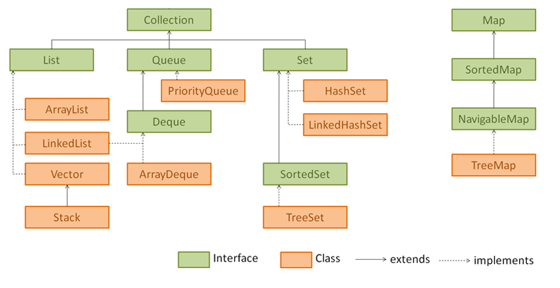

##JAVA CORE

###1. Методы Object.class
`toString()`,
`equals()`,
`hashcode()`,
`wait()`,
`notify()`,
`notifyAll()`,
`getClass()`.
###2. equals() & hashcode()
`equals()` гарантирует: если `o1.equals(o2)` вернул `true`, то объекты равны. Если `false`, то элементы точно _не равны_ друг другу.

`hasCode()` гарантирует что если у 2х объектов разные хэшкоды - эти объекты точно разные, а если хэшкоды равны то либо объекты равны, либо произошла коллизия.

При вызове o1.equals(o2) сначала сравниваются их хэшкоды, если хеши не равны, выдаётся `false`, если равны, то вызывается метод `equals()`, который работает долго, но выдаёт точный ответ. (сравнивая объекты по ссылкам) 

_Стоит отметить, что для корректной работы, при создании собственного класса, всегда нужно переопределять методы `equals()` и `hasCode()`._
- Рефлексивность. для любого заданного значения x, выражение x.equals(x) должно возвращать true. (Заданного — имеется в виду такого, что x != null)
- Симметричность. для любых заданных значений x и y, x.equals(y) должно возвращать true только в том случае, когда y.equals(x) возвращает true.
- Транзитивность. для любых заданных значений x, y и z, если x.equals(y) возвращает true и y.equals(z) возвращает true, x.equals(z) должно вернуть значение true.
- Согласованность. для любых заданных значений x и y повторный вызов x.equals(y) будет возвращать значение предыдущего вызова этого метода при условии, что поля, используемые для сравнения этих двух объектов, не изменялись между вызовами.
- Сравнение null. для любого заданного значения x вызов x.equals(null) должен возвращать false

###3. Exceptions (Исключения)
#### Иерархия

#### _Прим:_
При создании собственного исключения, если мы хотим сделать его проверяемым мы должны наследовать его, например, от I/O Exception

#### Обработка исключений
1. try/catch
2. try/catch+finaly. finaly{} выполнится практически в любом случае, за исключением того, когда в самом блоке finally вылетает ошибка
3. try with resources. В try создаем некие сущности, которые должны поддерживать интерфейс AutoClosable. По окончанию блока try, 
не зависимо от того было ли исключение или нет, эти сущности закроются. (исп. для чтения потоков или соединения с БД)
#### Можно ли поймать Runtime exception?
Да, можно
#### Когда следует ловить Error?
В общем случае его не стоит ловить, но в частном случае OutOfMemoryErr иногда полезно отлавливать.

###4. Абстрактный класс vs Интерфейс
1. Интерфейс описывает только поведение. У него нет состояния. А у абстрактного класса состояние есть: он описывает и то и другое. (в абс. классе можно создавать переменные и сеттеры\геттеры для них, в интерфейсе – нет).
2. Абстрактный класс связывает между собой и объединяет классы, имеющие очень близкую связь (абстр. Класс Птица и Класс наследник Соловей). 
В то же время, один и тот же интерфейс могут реализовать классы, у которых вообще нет ничего общего (инт. Летающий и реализующие его классы Птица и Самолёт).
3. Разрешена множественная реализация интерфейсов (множественное наследование классов запрещено)

#### Дефолтная реализация интерфейсов
1. Сохранение обратной совместимости. Чтобы не было нужды переопределять новый метод интерфейса всех его реализациях, 
пишешь `default` перед названием метода в интерфейсе и всё.
2. Реализация по-дефолту

_Прим.:_ Если класс реализует 2 интерфейса, в каждом из которых есть одинаково названные дефолтные методы, неообходимо будет в явном виде переопредлить 
этот метод в классе и указать, чью именно реализацию использовать.

```java
public class Car implements Vehicle, Alarm {

    @Override
    public String turnAlarmOn() {
        return Vehicle.super.turnAlarmOn();
    }
    
    @Override
    public String turnAlarmOff() {
        return Vehicle.super.turnAlarmOff();
    }
}
``` 

###5. Collections
#### Иерархия

#### Как внутри устроена HashMap?
HashMap состоит из массива односвязных списков - бакетов, размером 16. 
При добавлении пары K-V в HashMap высчитывается hashcode ключа `key.hashcode()` и побитово умножается на (n-1), где n - длинна внутреннего массива. 
Получается число от 0 до n-1. Данная пара K-V помещается в ячейку соответствующей, числу, полученному в предыдущей операции.
Со всеми следующими парами K-V работа аналогичная.
Если элементов становится слишком много, в HashMap выделяется еще один массив размерностью 16 (_Или каждый бакет становится красно-черным деревом_)
#### Как внутри устроена TreeMap?
Красно-черное дерево

#### Можно ли положить в HashMap объекты, у которых не переопределены методы `equals()` и `hasCode()`?
Можно, но тогда теряется эффективность и скорость работы HashMap

#### Как по другому можно заимплементить Map?
Как простой массив []

###6. Multithreading (Многопоточность)
#### Способы создания потока:
1. `Clazz extends Thread`. В таком случае клас будет _являться_ потоком. 
Для запуска вызываем метод `start()`
2. `Clazz implements Runnable` переопределить единственный метод `run()`, внутри которого указать, что конкретно будет выполняться данным потоком

_Эти способы не используются на реальных проектах. У разработчика не должно быть возможности самому создавать треды, иначе может начать вылетать ошибки. 
Например, Разработчик создал много тредов и, так как под каждый новый тред выделяется фиксированное количество мегабайт (например, 1Мб), то программа начинает уходить в своп при переполнении оперативной памяти._ 
3. `concurrent.ExecutorService` - фреймворк для работы с потоками. Также в этом фреймворке есть классы для работы с ассинхронностью.

#### Как сделать метод потокобезопасным?
`synchronized` Можно сделать синхронизацию либо по объекту, либо по методу.

#### Какие есть методы для работы с потоками?
`wait(), notify(), notifyAll()`

_Их можно использовать только в synchronized блоках_


##Структуры данных
###1. Структуры данных
#### Динамический массив
#### Связный список
#### Бинарное(двоичное) дерево
Всё, что меньше корня идёт по левой ветке, всё что больше по правой. Корень - первый элемент, помещенный в дерево, 
листья - последние элементы, ноды(узлы) - промежуточные. Каждая нода с его потомками отдельное дерево. 

Бинарное дерево лучше использовать при неотсортированных данных. 
Если в бинарное дерево подавать отсортированные данные, то оно вырождается в двусвязный список. 
Сложность всех операций (bad way) такая же, как и у двусвязного списка `O(n)` (медленная)
#### Красно-черное дерево
Самобалансирующееся Бинарное дерево, такое что:
1. Количество черных нод в каждой ветке держится одинаковым.
2. Корень глобального дерева всегда черный (корни поддеревьев могут быть красными)
3. У каждой красной ноды дочки черные
4. Листья (последние элементы в ветке) всегда черные и null.
   
_Когда одна ветвь становится длиннее других, происходит перебалансировка_

Сложность по всем операциям - `O(log(n))`
#### Б-дерево ??? (каждая нода - массив)
###2. Алгоритмическая сложность


###3. Сортировки

#### Сортировка пузырьком

```java
class Scratch {
    public int[] bubbleSort(int[] arr) {
        for(int i = arr.length-1 ; i > 0 ; i--) {
            for(int j = 0 ; j < i ; j++){
                if( arr[j] > arr[j+1] ) {
                    int tmp = arr[j];
                    arr[j] = arr[j+1];
                    arr[j+1] = tmp;
                }
            }
        }
    }
}
```
##Паттерны
###1. SOLID
S _single responsibility principle_- принцип единственности ответственности. 
У каждого класса должен быть только один мотив для изменений

O _open/closed principle_ – принцип открытости\закрытости. Класс должен быть открыт для расширения и закрыт для изменения. 
Нужно стараться расширять (extend) классы, а не изменять их (Не ломать уже существующий код)

L _Принцип подстановки Лисков_. Подклассы должны дополнять, а не замещать поведение базового класса. 
(Тип ПАРАМЕТРОВ МЕТОДА подкласса должен совпадать или быть более абстрактным, чем типы параметров базового класса, 
и наоборот тип ВОЗВРАЩАЕМОГО ЗНАЧЕНИЯ метода подкласса должен совпадать или быть подтипом возвращаемого значения базового класса)

I _interface segregation principle_. Принцип разделения интерфейса. Клиенты не должны зависеть от методов, которые они не используют. 
(нужно стараться делать узкоспециализированные интерфейсы, чтобы не приходилось реализовывать избыточное поведение)

D _Принцип инверсии зависимости_. Классы верхних уровней не должны зависеть от классов нижних уровней. Оба должны зависеть от абстракций. 
Абстракции не должны зависеть от деталей. Детали должны зависеть от абстракций. (Зависимости должны быть не напрямую (сильными), 
а через абстракции(слабыми)). _*Прим.:_ Зависимости через интерфейсы, а не через наследование


##Базы данных
###1. ACID
_Атомарность_ (atomicity). Атомарность гарантирует, что каждая транзакция будет выполнена полностью или не будет выполнена совсем. 
Не допускаются промежуточные состояния.

_Согласованность_ (consistency). В результате работы транзакции данные будут допустимыми. 
Это вопрос не технологии, а бизнес-логики: например, если количество денег на счете не может быть отрицательным, логика транзакции должна проверять, не выйдет ли в результате отрицательных значений.

_Изолированность_ (isolation). Гарантия того, что параллельные транзакции не будут оказывать влияния на результат других транзакций.

_Долговечность_ (durability). Изменения, получившиеся в результате транзакции, должны оставаться сохраненными вне зависимости от каких-либо сбоев. 
Иначе говоря, если пользователь получил сигнал о завершении транзакции, он может быть уверен, что данные сохранены.

###2. Изолированность БД (TODO refactor)
- _Версионирование_ (snapshot) означает, что транзакции будут работать со своей копией данных, не влияя друг на друга, 
но впоследствии несколько изменённых копий надо будет как-то слить в одну. Строгость версионирования регулирует моменты (когда) и размеры (сколько данных копировать) этих копий.
- _Блокирование_ (lock) означает, что одна транзакция будет ждать другую, чтобы избежать побочных эффектов, 
в зависимости от строгости уровней изоляции этих транзакций. Различные виды блокировок обеспечивают более гранулярное блокирование, 
например, только по строкам, или только на небольшой кусочек транзакции, а не на всю.

###3. Уровни изолированность БД (TODO refactor)
- _Read Uncommitted_. Ничего не происходит в режиме read uncomitted. То есть ничего не блокируется и не создаются снэпшоты, транзакция просто читает всё что хочет. 
По смыслу, этот режим можно отнести к (очень) оптимистичному — блокировки редки и коротки.
- _Read committed_ (то есть отсутсвие dirty reads) обеспечивается блокировкой на запись данных (строк), которые мы пытаемся прочитать. 
Эта блокировка гарантирует, что мы подождём завершения транзакций, которые уже меняют наши данные, или заставим их подождать, пока мы будем читать. В итоге, мы точно прочитаем только данные, которые были закоммичены, избежав тем самым грязное чтение. Этот режим — типичный пример пессимистичной блокировки, так как мы блокируем данные на запись, даже если в них никто реально не пишет.
- _Read commited_ snapshot (второй способ избежать dirty reads) обеспечивается версионированием блока данных, который мы читаем. 
Любое его параллельное изменение на затронет нашу версию, и нам достанутся данные на момент начала чтения. Таким образом грязное чтение отсутствует, и ещё отсутствуют какие-либо блокировки*. Этот режим скорее оптимистичный, так как заранее ничего не блокируется, и тут как раз может быть конфликт обновления.
- _Repeatable read_ (то есть отсутствие всего, кроме фантомных чтений) обеспечивается почти как read commited, за тем исключением, 
что блокировка на запись работает до конца транзакции, а не отдельной операции. Единожды “коснувшись” блока данных, транзакция блокирует его изменение до конца работы, что обеспечивает отсутствиуе dirty reads и non-repeatable reads. Это более пессимистичный вид блокировки, чем read committed, так как блокировка держится ещё дольше.
- _Serializable_ (нет никаких побочных эффектов) обеспечивается блокировкой и на запись, и на чтение любого блока данных, с которым мы работаем. 
Блокируется даже вставка данных, которые могут попасть в блок, который мы прочитали. Таким образом, за счёт низкой конкурентности, обеспечивается отсутствие даже фантомных чтений. Это более пессимистичный вид блокировки, чем repeatable read, так как блокировка держится ещё дольше.
- _Snapshot_ обеспечивается созданием нашей отдельной версии данных, с которыми мы работаем, без блокировок*. Другие транзакции не будут иметь доступ к нашей версии, чем и обеспечивается отсутствие всего вплоть до фантомных чтений. Это оптимистичный вид блокировки, но менее оптимистичный, чем read committed snapshot, так как больше шансов получить конфликт обновления.

##Микросервисная архитектура
###1. CAP
В любой реализации распределённых вычислений возможно обеспечить не более двух из трёх следующих свойств:
- согласованность данных (англ. consistency) — во всех вычислительных узлах в один момент времени данные не противоречат друг другу;
- доступность (англ. availability) — любой запрос к распределённой системе завершается корректным откликом, однако без гарантии, что ответы всех узлов системы совпадают;
- устойчивость к разделению (англ. partition tolerance) — расщепление распределённой системы на несколько изолированных секций не приводит к некорректности отклика от каждой из секций.


