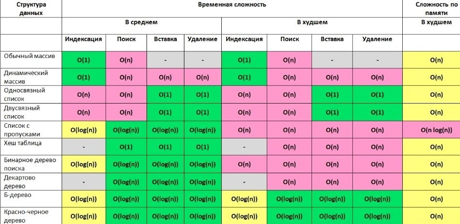

##JAVA CORE

###1. Методы Object.class
`toString()`,
`equals()`,
`hashcode()`,
`wait()`,
`notify()`,
`notifyAll()`,
`getClass()`.
###2. equals() & hashcode()
`equals()` гарантирует: если `o1.equals(o2)` вернул `true`, то объекты равны. Если `false`, то элементы точно _не равны_ друг другу.

`hasCode()` гарантирует что если у 2х объектов разные хэшкоды - эти объекты точно разные, а если хэшкоды равны то либо объекты равны, либо произошла коллизия.

При вызове o1.equals(o2) сначала сравниваются их хэшкоды, если хеши не равны, выдаётся `false`, если равны, то вызывается метод `equals()`, который работает долго, но выдаёт точный ответ. (сравнивая объекты по ссылкам) 

_Стоит отметить, что для корректной работы, при создании собственного класса, всегда нужно переопределять методы `equals()` и `hasCode()`._
- Рефлексивность. для любого заданного значения x, выражение x.equals(x) должно возвращать true. (Заданного — имеется в виду такого, что x != null)
- Симметричность. для любых заданных значений x и y, x.equals(y) должно возвращать true только в том случае, когда y.equals(x) возвращает true.
- Транзитивность. для любых заданных значений x, y и z, если x.equals(y) возвращает true и y.equals(z) возвращает true, x.equals(z) должно вернуть значение true.
- Согласованность. для любых заданных значений x и y повторный вызов x.equals(y) будет возвращать значение предыдущего вызова этого метода при условии, что поля, используемые для сравнения этих двух объектов, не изменялись между вызовами.
- Сравнение null. для любого заданного значения x вызов x.equals(null) должен возвращать false

###3. Exceptions (Исключения)
#### Иерархия

#### _Прим:_
При создании собственного исключения, если мы хотим сделать его проверяемым мы должны наследовать его, например, от I/O Exception

#### Обработка исключений
1. try/catch
2. try/catch+finaly. finaly{} выполнится практически в любом случае, за исключением того, когда в самом блоке finally вылетает ошибка
3. try with resources. В try создаем некие сущности, которые должны поддерживать интерфейс AutoClosable. По окончанию блока try, 
не зависимо от того было ли исключение или нет, эти сущности закроются. (исп. для чтения потоков или соединения с БД)
#### Можно ли поймать Runtime exception?
Да, можно
#### Когда следует ловить Error?
В общем случае его не стоит ловить, но в частном случае OutOfMemoryErr иногда полезно отлавливать.

###4. Collections
#### Иерархия

#### Как внутри устроена HashMap?
HashMap состоит из массива односвязных списков - бакетов, размером 16. 
При добавлении пары K-V в HashMap высчитывается hashcode ключа `key.hashcode()` и побитово умножается на (n-1), где n - длинна внутреннего массива. 
Получается число от 0 до n-1. Данная пара K-V помещается в ячейку соответствующей, числу, полученному в предыдущей операции.
Со всеми следующими парами K-V работа аналогичная.
Если элементов становится слишком много, в HashMap выделяется еще один массив размерностью 16 (_Или каждый бакет становится красно-черным деревом_)
#### Как внутри устроена TreeMap?
Красно-черное дерево

#### Можно ли положить в HashMap объекты, у которых не переопределены методы `equals()` и `hasCode()`?
Можно, но тогда теряется эффективность и скорость работы HashMap

#### Как по другому можно заимплементить Map?
Как простой массив []

###5. Multithreading (Многопоточность)
#### Способы создания потока:
1. `Clazz extends Thread`. В таком случае клас будет _являться_ потоком. 
Для запуска вызываем метод `start()`
2. `Clazz implements Runnable` переопределить единственный метод `run()`, внутри которого указать, что конкретно будет выполняться данным потоком

_Эти способы не используются на реальных проектах. У разработчика не должно быть возможности самому создавать треды, иначе может начать вылетать ошибки. 
Например, Разработчик создал много тредов и, так как под каждый новый тред выделяется фиксированное количество мегабайт (например, 1Мб), то программа начинает уходить в своп при переполнении оперативной памяти._ 
3. `concurrent.ExecutorService` - фреймворк для работы с потоками. Также в этом фреймворке есть классы для работы с ассинхронностью.

#### Как сделать метод потокобезопасным?
`synchronized` Можно сделать синхронизацию либо по объекту, либо по методу.

#### Какие есть методы для работы с потоками?
`wait(), notify(), notifyAll()`

_Их можно использовать только в synchronized блоках_

##Структуры данных
###1. Структуры данных
#### Динамический массив
#### Связный список
#### Бинарное(двоичное) дерево
Всё, что меньше корня идёт по левой ветке, всё что больше по правой. Корень - первый элемент, помещенный в дерево, 
листья - последние элементы, ноды(узлы) - промежуточные. Каждая нода с его потомками отдельное дерево. 

Бинарное дерево лучше использовать при неотсортированных данных. 
Если в бинарное дерево подавать отсортированные данные, то оно вырождается в двусвязный список. 
Сложность всех операций (bad way) такая же, как и у двусвязного списка `O(n)` (медленная)
#### Красно-черное дерево
Самобалансирующееся Бинарное дерево, такое что:
1. Количество черных нод в каждой ветке держится одинаковым.
2. Корень глобального дерева всегда черный (корни поддеревьев могут быть красными)
3. У каждой красной ноды дочки черные
4. Листья (последние элементы в ветке) всегда черные и null.
   
_Когда одна ветвь становится длиннее других, происходит перебалансировка_

Сложность по всем операциям - `O(log(n))`
#### Б-дерево ??? (каждая нода - массив)
###2. Алгоритмическая сложность

